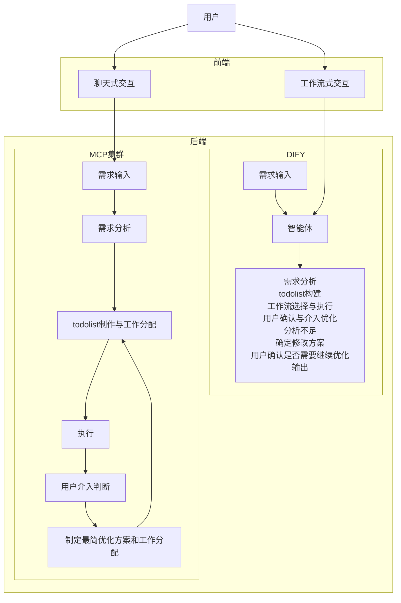

# AI设计平台架构文档

## 1. 系统架构概览

### 1.1 整体架构图



### 1.2 架构设计原则

- **解耦设计**: 前端、后端、MCP集群相互独立
- **模块化**: 每个功能模块职责单一，接口清晰
- **可扩展**: 支持新功能和新工具的快速集成
- **高可用**: 分布式部署，故障隔离

## 2. 系统分层架构

### 2.1 表现层 (Presentation Layer)

#### 2.1.1 工作流式交互界面
- **功能**: 步骤化设计流程展示
- **特点**: 
  - 清晰的流程导航
  - 实时进度显示
  - 每步结果预览
  - 用户确认机制

#### 2.1.2 聊天式交互界面
- **功能**: 自然语言交互
- **特点**:
  - 对话式界面
  - 智能需求理解
  - 动态任务展示
  - 灵活的交互方式

### 2.2 业务逻辑层 (Business Logic Layer)

#### 2.2.1 Dify工作流引擎
- **核心组件**:
  - 智能体管理器
  - 工作流编排器
  - 需求分析器
  - 任务调度器

- **主要功能**:
  - 需求输入处理
  - 智能体调用
  - 工作流选择与执行
  - 用户确认与介入优化
  - 输出结果管理

#### 2.2.2 MCP集群
- **核心组件**:
  - 需求分析模块
  - 任务分配模块
  - 执行引擎
  - 优化决策模块

- **主要功能**:
  - 需求深度分析
  - TodoList制作与工作分配
  - 设计任务执行
  - 用户介入判断
  - 优化方案制定

### 2.3 服务层 (Service Layer)

#### 2.3.1 设计服务集群
- **器形设计服务**: 产品外形和结构设计
- **花纸设计服务**: 装饰图案和纹理设计
- **材质选择服务**: 材料属性和质感选择
- **花纸贴合服务**: 装饰图案应用
- **产品渲染服务**: 最终效果图生成

#### 2.3.2 AI模型服务
- **LiblibAI API**: 图像生成和处理
- **ComfyUI工作流**: 复杂设计流程执行
- **自定义模型**: 特定场景优化模型

### 2.4 数据层 (Data Layer)

#### 2.4.1 业务数据
- 用户需求数据
- 设计任务数据
- 工作流配置数据
- 结果输出数据

#### 2.4.2 模型数据
- AI模型配置
- 设计模板库
- 材质纹理库
- 历史设计案例

## 3. 关键技术架构

### 3.1 MCP (Model Context Protocol) 架构

#### 3.1.1 MCP服务器
- **LiblibAI MCP**: 封装LiblibAI API调用
- **设计工具MCP**: 封装各种设计工具
- **文件处理MCP**: 处理图片上传下载
- **工作流MCP**: 封装ComfyUI工作流

#### 3.1.2 MCP客户端
- **Dify集成**: 在Dify中调用MCP服务
- **智能体工具**: 为智能体提供工具调用能力
- **任务执行器**: 执行具体的设计任务

### 3.2 Dify集成架构

#### 3.2.1 工作流设计
- **需求分析节点**: 理解用户需求
- **任务规划节点**: 制定执行计划
- **工具调用节点**: 调用MCP工具
- **结果处理节点**: 处理执行结果
- **用户交互节点**: 用户确认和反馈

#### 3.2.2 智能体配置
- **设计专家智能体**: 负责设计决策
- **工具调用智能体**: 负责工具选择和调用
- **质量评估智能体**: 负责结果评估
- **优化建议智能体**: 负责改进建议

## 4. 数据流架构

### 4.1 工作流式交互数据流

```
用户需求 → Dify工作流 → 智能体分析 → MCP工具调用 → 
设计执行 → 结果生成 → 用户确认 → 优化迭代 → 最终输出
```

### 4.2 聊天式交互数据流

```
用户对话 → MCP需求分析 → 任务拆解 → 工具选择 → 
并行执行 → 结果整合 → 用户反馈 → 持续优化
```

## 5. 部署架构

### 5.1 本地开发环境
- **Dify**: Docker本地部署
- **MCP服务**: Node.js本地运行
- **前端应用**: 开发服务器
- **数据库**: 本地数据库实例

### 5.2 生产环境
- **容器化部署**: Docker + Kubernetes
- **负载均衡**: Nginx + 多实例部署
- **数据存储**: 分布式数据库
- **监控告警**: 完整的监控体系

## 6. 安全架构

### 6.1 API安全
- **密钥管理**: 安全的密钥存储和轮换
- **签名验证**: 请求签名验证机制
- **访问控制**: 基于角色的访问控制
- **流量限制**: API调用频率限制

### 6.2 数据安全
- **数据加密**: 敏感数据加密存储
- **传输安全**: HTTPS/TLS加密传输
- **隐私保护**: 用户数据隐私保护
- **备份恢复**: 数据备份和恢复机制

## 7. 扩展性设计

### 7.1 水平扩展
- **微服务架构**: 服务独立扩展
- **负载均衡**: 请求分发和负载均衡
- **缓存机制**: 多级缓存提升性能
- **异步处理**: 异步任务处理机制

### 7.2 功能扩展
- **插件机制**: 支持第三方插件
- **模板系统**: 可配置的设计模板
- **工具集成**: 新工具快速集成
- **模型适配**: 新AI模型快速接入